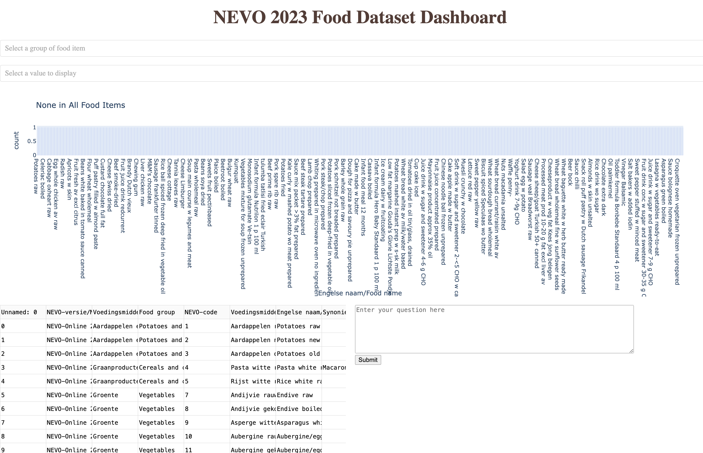

# question-answering-system-on-food

## Steps
1. Install dependencies
   
```pip install -r /path/to/requirements.txt```
3. Run the dashboard

```python dashboard.py```
4. Access the dashboard through [https://127.0.1.0:8050/](http://127.0.0.1:8050/)

